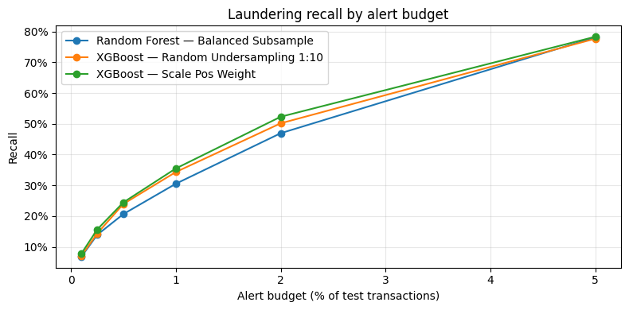
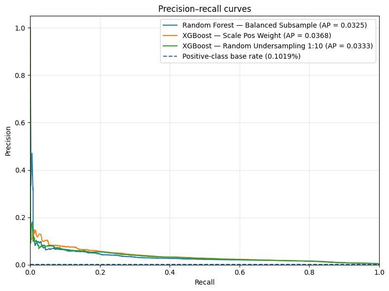
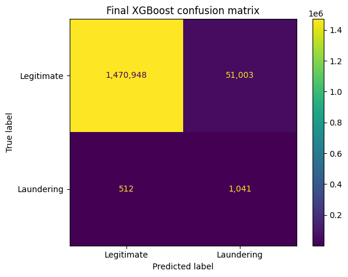
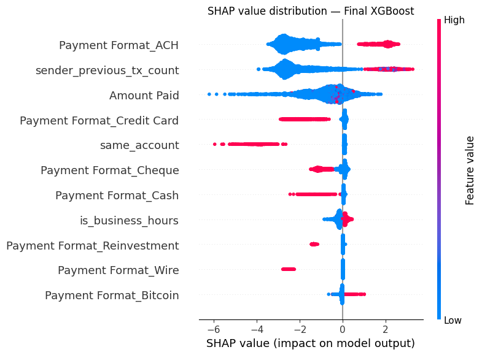

# AMLGuard — Anti-Money Laundering Detection under Extreme Class Imbalance

**End-to-end machine-learning pipeline for financial-crime / fraud detection on a highly imbalanced transaction dataset (~0.1% illicit).** Built with Python, scikit-learn, XGBoost, imbalanced-learn and SHAP, and evaluated the way a production compliance team actually operates — by *alert budget* and *recall at a fixed precision*, not by accuracy.


> **Live recruiter demo:** [Open AMLGuard on Streamlit](https://amlguard-demo.streamlit.app) — public inference with the frozen model artifact, validated on Python 3.12.

> **Skills demonstrated:** fraud detection · anomaly detection · imbalanced classification · precision–recall / PR-AUC (Average Precision) · feature engineering · data-leakage prevention · threshold tuning · cost-sensitive learning · XGBoost · Random Forest · Logistic Regression · SHAP explainability · model evaluation · **FastAPI + Pydantic serving** · **Docker (multi-stage, GHCR)** · **CI/CD (GitHub Actions)** · **MLflow tracking & model registry** · **Azure ML pipelines** · **Azure ML Managed Online Endpoints** · **Azure Monitor** · **Model Data Collector** · **model monitoring** · **data drift / prediction drift (PSI)** · **retraining strategy** · **real-time inference** · **cloud model deployment** · **public Streamlit recruiter demo** · pytest (60 tests) · reproducibility engineering · **portfolio-readiness audit** · **release engineering**.

---

## TL;DR

On **5,078,345** real-schema transactions where only **0.1019%** are laundering, a naïve "everything is legitimate" classifier scores **99.9% accuracy** and catches **zero** criminals — so accuracy is discarded from the start. AMLGuard instead ranks transactions by risk and selects an operating point against a realistic analyst workload.

**Selected model — XGBoost with `scale_pos_weight`, at a 2% minimum-precision operating point:**

| Metric | Value | What it means for a compliance team |
|---|---:|---|
| **Average Precision** | **0.0368** | Best ranking of all evaluated models (~36× the 0.001 base rate) |
| **Recall** | **67.0%** | Detects two-thirds of the labelled laundering transactions |
| **Precision** | **2.0%** | ~1 true case per 50 reviewed alerts |
| **Alert rate** | **3.42%** | Only 3.42% of transactions sent for human review |
| True / False positives | 1,041 / 51,003 | 1,041 laundering cases caught |
| False negatives | 512 | Undetected laundering — the residual regulatory risk |

The point of the project is **not** a claim that laundering is "solved." It is a documented, leakage-aware, operationally-evaluated pipeline that makes the precision–recall–workload trade-off explicit.

---

## Why this problem matters (business context)

The EU's **Anti-Money Laundering Authority (AMLA)**, based in Frankfurt, took over the EU-level AML/CFT mandates from the European Banking Authority on **1 January 2026** and will directly supervise up to ~40 high-risk cross-border institutions from 2028. European banks are under rising regulatory pressure while drowning in **false positives** — legacy monitoring systems raise far more alerts than analysts can review. Because illicit activity is **well under 1%** of all transactions, this is a textbook **extreme class-imbalance** problem, which is exactly what AMLGuard is built to handle.

---

## Dataset

- **Source:** [IBM Transactions for Anti-Money Laundering (AML)](https://www.kaggle.com/datasets/ealtman2019/ibm-transactions-for-anti-money-laundering-aml) — version **HI-Small** (high illicit ratio).
- **Size:** 5,078,345 transactions · **5,177** labelled laundering cases · **0.1019%** positive rate · ~18-day window.
- **License:** Community Data License Agreement — Sharing 1.0.
- **Note on validity:** the data is **synthetic**. Strong signals may reflect simulator rules rather than generalisable laundering behaviour, so every high-lift feature is interpreted critically throughout the notebook.

---

## Results at a glance

**Recall grows with the alert budget** — the core operational trade-off. More analyst capacity → more laundering caught, at diminishing returns:



**Precision–recall curves** (the correct lens under extreme imbalance — ROC would be misleadingly optimistic here):



**Selected operating point — confusion matrix** (XGBoost, threshold ≈ 0.892, precision fixed at 2%):



### Model comparison (default threshold 0.50)

| Model | Average Precision | Recall | Precision | Alert rate |
|---|---:|---:|---:|---:|
| **XGBoost — Scale Pos Weight** | **0.0368** | 89.6% | 0.82% | 11.2% |
| XGBoost — Random Undersampling 1:10 | 0.0333 | 60.3% | 2.19% | 2.81% |
| Random Forest — Balanced Subsample | 0.0325 | 81.8% | 1.47% | 5.67% |
| Logistic Regression — Balanced | 0.0084 | 90.3% | 0.73% | 12.6% |
| Logistic Regression — Unweighted | 0.0092 | 0.0% | — | 0.0% |
| Dummy (most-frequent) | 0.0010 | 0.0% | — | 0.0% |

**Methodological finding:** class weighting did **not** improve Average Precision over the unweighted linear model — it only shifted where the 0.50 threshold falls. Re-weighting is therefore treated as an implicit *threshold* intervention, and the real lever is **threshold tuning on the best-ranking model**, not reflexive rebalancing.

---

## Methodology

1. **Descriptive analysis & EDA** — quantify the imbalance; test hypotheses (payment format, cross-currency, same-bank) using **illicit rate within group**, never raw counts.
2. **Feature engineering (leakage-safe):** `Payment Format`, `Amount Paid`, `sender_previous_tx_count` (chronological `cumcount` — no future information), `is_business_hours`, `same_account`. Cross-currency, account/bank IDs and redundant amount columns are **excluded** with documented justification.
3. **Data preparation:** stratified 70/30 split; all encoding/scaling fitted **inside the pipeline on the training fold only** to prevent data leakage.
4. **Modelling:** Dummy → Logistic Regression (weighted + unweighted control) → Random Forest → **XGBoost** → random undersampling. Imbalance handled via `class_weight` / `scale_pos_weight` / undersampling; SMOTE scope explicitly reasoned about rather than blindly applied.
5. **Evaluation for the real world:** precision–recall curves, **recall at fixed precision** (0.5% / 1% / 2% / 5%), and **recall under fixed alert budgets** — translating the threshold into "how much can the compliance team review per day."
6. **Explainability:** **SHAP** global (beeswarm) + local explanations for the highest-risk true-positive and false-positive alerts, with sparse-matrix consistency assertions and a model-risk note on potentially generator-specific features.
7. **Minimal serving layer:** in-notebook scoring function + optional **FastAPI** `/score` + `/health` skeleton.

---

## Explainability (SHAP)

Global feature contributions for the selected XGBoost model. Explanations improve **auditability** but do not prove causality, and features such as `same_account` are flagged as potentially encoding synthetic-generator rules:



---

## Production architecture (Phase 2 — delivered)

The academic notebook was refactored into a tested, containerised, cloud-deployed and monitored service over a 24-day end-to-end delivery schedule. Every model-changing step is gated against the frozen baseline in [`artifacts/baseline_metrics.json`](./artifacts/baseline_metrics.json): a refactor is only accepted if it reproduces the validated metrics, and model promotion occurs only after explicit quality and regression gates pass.

| Layer | What exists | Proof |
|---|---|---|
| **Package + tests** | `src/` package (data, features, models, api) with **60 pytest tests**, synthetic fixtures (no CSV needed in CI) | `pytest` → 60 passed; `ruff` clean |
| **Serving** | FastAPI app: `/health`, `/model-info`, `/predict`, `/predict-batch` with Pydantic validation and in-process model cache | Interactive docs at `/docs` |
| **Container** | Multi-stage Dockerfile (671 MB), non-root user, HEALTHCHECK; `docker compose up` for one-command boot | `hadolint` clean |
| **CI/CD** | GitHub Actions: ruff + pytest + hadolint on every push; Docker image built and pushed to GHCR on `main` | CI badge above; [Actions history](https://github.com/caiobernardinelli/amlguard/actions) |
| **Model registry** | MLflow tracking (SQLite backend) + PyFunc-packaged model with `candidate` / `champion` aliases and a documented promotion flow | [`docs/MODEL_PROMOTION.md`](./docs/MODEL_PROMOTION.md) |
| **Cloud pipeline** | Azure ML workspace, versioned data asset, reusable command components (prepare / train / evaluate), end-to-end pipeline, gated promotion and registered `AMLGuard:1` model asset | [`docs/AZURE_PIPELINE.md`](./docs/AZURE_PIPELINE.md) |
| **Real-time cloud inference** | Azure ML Managed Online Endpoint was deployed and validated with key authentication, dedicated inference environment, `blue` deployment and 100% traffic routing; it was later deleted after monitoring validation to stop continuous inference-compute cost | [`docs/AZURE_ONLINE_ENDPOINT.md`](./docs/AZURE_ONLINE_ENDPOINT.md) |
| **Monitoring & drift** | Azure Monitor latency/traffic telemetry, Azure ML Model Data Collector, paired input/output telemetry, alert-rate and score monitoring, PSI-based data/prediction drift workflow and retraining policy | [`docs/AZURE_MONITORING.md`](./docs/AZURE_MONITORING.md) |
| **Recruiter demo** | Public Streamlit Community Cloud application backed by the frozen `artifacts/model.joblib`; Python 3.12 runtime and score/alert/threshold/model-version parity validated through a live browser submission | [Live app](https://amlguard-demo.streamlit.app) · [documentation](./docs/RECRUITER_DEMO.md) · [evidence](./docs/evidence/day22_public_deployment.json) |
| **Portfolio readiness** | Manual-guided and repository-backed audit of Days 1-22, including exact Git history, evidence files, local-link checks and tracked-file hygiene | [documentation](./docs/PORTFOLIO_READINESS.md) · [evidence](./docs/evidence/day23_portfolio_readiness.json) |
| **Current release** | `v1.0.1` maintenance release correcting the headline metric rounding, aligning the FastAPI service version and adding permanent release-integrity tests; the frozen model contract remains `0.1.0` | [v1.0.1 release notes](./docs/RELEASE_NOTES_v1.0.1.md) · [v1.0.0 delivery record](./docs/FINAL_RELEASE.md) |

**Reproducibility, proven in the cloud:** the Azure ML end-to-end pipeline retrained and re-evaluated the model on Azure compute and reproduced the frozen baseline — Average Precision `0.036833` in the cloud vs `0.036833` frozen locally. Only after both quality and regression gates passed was `AMLGuard:1` registered ([pipeline evidence](./docs/evidence/day18_evaluation_metrics.json)).

**Serving, proven with a live cloud request:** `AMLGuard:1` was deployed behind an Azure ML Managed Online Endpoint. The validated request returned `score`, `alert`, the frozen `threshold = 0.892163`, and `model_version = 1`, with 100% of traffic routed to the `blue` deployment ([serving evidence](./docs/evidence/day19_online_endpoint.json)). After Day 20 monitoring validation, the endpoint was deleted to avoid continuous inference compute cost; the deployment code and evidence remain versioned.

**Monitoring, proven on the live endpoint:** Azure Monitor recorded successful 2xx traffic and server-side latency telemetry; Azure ML Model Data Collector persisted and paired 71 `model_inputs` / `model_outputs` records. A synthetic monitoring batch exercised alert-rate, score-distribution, data-drift and prediction-drift analysis. Significant PSI signals are documented as a monitoring-workflow demonstration only—not as evidence of real production drift ([monitoring docs](./docs/AZURE_MONITORING.md)).

**Recruiter demo, validated publicly:** the Streamlit Community Cloud application at [https://amlguard-demo.streamlit.app](https://amlguard-demo.streamlit.app) calls the same persisted AMLGuard prediction contract. A live browser submission reproduced the validated displayed score `0.9854`, alert decision, frozen threshold `0.892163` and model version `0.1.0` on Python 3.12 ([demo docs](./docs/RECRUITER_DEMO.md); [Day 22 evidence](./docs/evidence/day22_public_deployment.json)).

**Portfolio readiness, audited:** Day 23 cross-checks the intended deliveries from Days 1-22 against the study manuals, current repository artifacts, exact Git history and structured evidence. The permanent validator also checks local Markdown links, tracked-file hygiene and public-demo references ([audit documentation](./docs/PORTFOLIO_READINESS.md); [Day 23 evidence](./docs/evidence/day23_portfolio_readiness.json)).

**Current maintenance release:** `v1.0.1` preserves the frozen model contract as `0.1.0`, corrects the README Average Precision display to `0.0368`, aligns `/health` and OpenAPI with service version `1.0.1`, and adds permanent tests for version-domain separation and model-artifact integrity ([v1.0.1 release notes](./docs/RELEASE_NOTES_v1.0.1.md)).

> **Study manuals:** the PDFs in [`docs/manuals/`](./docs/manuals/) are Portuguese-language learning records documenting the development process. Production code, technical documentation, release notes and recruiter-facing materials remain in English.

### Run the service without installing anything (Docker)

```bash
# Pull the published image from GitHub Container Registry
docker pull ghcr.io/caiobernardinelli/amlguard:latest

# Boot it (no model mounted: /health and /docs work; /predict returns 503)
docker run --rm -p 8000:8000 ghcr.io/caiobernardinelli/amlguard:latest

# Then open http://localhost:8000/docs
```

To score transactions, train a model first (`python -m src.models.train`) and boot via compose, which bind-mounts it:

```bash
docker compose up   # http://localhost:8000/docs → try POST /predict
```

---

## Repository structure

```
amlguard/
├── notebooks/
│   └── 01_aml_pipeline.ipynb        # Phase 1 — full academic pipeline (EDA → models → SHAP)
├── src/
│   ├── config.py                    # single source of truth: paths, seed, features, gates
│   ├── data/load_data.py            # schema-validated CSV loader
│   ├── features/build_features.py   # leakage-safe features (byte-parity with the notebook)
│   ├── models/
│   │   ├── train.py                 # reproducible training (deterministic artifacts)
│   │   ├── evaluate.py              # dual regression gates vs frozen baseline
│   │   ├── predict.py               # unified prediction contract + model cache
│   │   ├── tracking.py              # MLflow experiment tracking
│   │   └── mlflow_model.py          # PyFunc packaging + candidate/champion aliases
│   └── api/main.py                  # FastAPI: /health /model-info /predict /predict-batch
├── tests/                           # 60 tests, CSV-free (synthetic fixtures)
├── cloud/azure/                     # Azure ML: data, components, pipelines, online serving
│   └── online/                      # endpoint, monitored deployment, inference env, score.py
├── demo/
│   ├── app.py                       # Public Streamlit recruiter-facing demo
│   └── requirements.txt             # Pinned Community Cloud runtime
├── scripts/monitoring/              # synthetic traffic, collection validation, drift reporting
├── scripts/demo/                    # recruiter-demo validation and evidence generation
├── scripts/audit/                   # portfolio-readiness validation and evidence generation
├── artifacts/model.joblib           # frozen small model artifact used by the recruiter demo
├── artifacts/baseline_metrics.json  # FROZEN baseline — the regression guard
├── docs/                            # baseline, Azure, monitoring, retraining docs + run evidence
├── Dockerfile                       # multi-stage build (671 MB runtime image)
├── docker-compose.yml               # one-command local boot with model bind-mount
├── .github/workflows/ci.yml         # ruff + pytest + hadolint + GHCR publish
├── CHANGELOG.md                     # portfolio release history
└── pyproject.toml
```

---

## How to reproduce

```bash
# 1. Clone
git clone https://github.com/caiobernardinelli/amlguard.git
cd amlguard

# 2. Environment (Python 3.10+)
python -m venv .venv && source .venv/bin/activate   # Windows: .venv\Scripts\activate
pip install -e ".[serve,dev,demo]"

# 3. Verify the refactored pipeline (no dataset needed — fixtures are synthetic)
pytest            # expected: 60 passed
python -m ruff check src tests demo scripts

# 4. Full training on the real dataset (downloads the 476 MB CSV on first run)
python -m src.models.train        # writes artifacts/model.joblib, gate must PASS
python -m src.models.evaluate     # compares against the frozen baseline

# 5. Serve the API
uvicorn src.api.main:app --reload # http://127.0.0.1:8000/docs

# (Phase 1 notebook, if you want the full analysis)
jupyter lab notebooks/01_aml_pipeline.ipynb
```

The raw CSV is intentionally **not** committed; the loader fetches it at runtime. For a clean notebook run, use **Kernel → Restart & Run All**.

---

## Limitations (stated honestly)

- **Synthetic data** and an **~18-day window** limit external validity.
- The **random stratified split** does not reproduce a true future-deployment period; the same entities may appear in train and test.
- No KYC, sanctions, geography or investigation-history context is available.
- `same_account` and some payment-format signals may reflect **simulator rules**, so results should not be read as real-world laundering laws.

---

## Roadmap (modelling improvements)

The core MLOps stack (FastAPI · Docker/GHCR · CI/CD · MLflow · Azure ML pipelines · model registry · Managed Online Endpoint · Azure Monitor · Model Data Collector · drift workflow) is **delivered** — see [Production architecture](#production-architecture-phase-2--delivered). What remains on the roadmap is deeper model-science and analyst-facing product work:

| Priority | Improvement | Value |
|---|---|---|
| 1 | Temporal + entity-aware validation | Generalisation to future periods / unseen accounts |
| 2 | Independent threshold calibration | Separate model comparison, operating-point choice, final eval |
| 3 | Rolling behavioural features | Velocity over multiple windows, counterparty diversity |
| 4 | **Graph features (NetworkX)** | Fan-in/fan-out, cycles, hubs — laundering as a network |
| 5 | Sensitivity analysis without `same_account` | Quantify dependence on a possibly confounded signal |
| 6 | SMOTENC / cost-sensitive comparison | Category-aware resampling |
| 7 | Probability calibration | Stable, interpretable risk scores |
| 8 | Production monitoring dashboards + analyst triage workflow | Richer long-running operational views and a production-oriented analyst layer; the lightweight recruiter-facing Streamlit demo is already delivered publicly |

---

## Author

**Caio Bernardinelli** — Data & AI professional transitioning from 15 years across engineering, Business Intelligence and data. Building end-to-end ML pipelines for the EU and Brazilian markets.
Holds **Portuguese (EU) citizenship** — eligible to work in the European Union without a visa.

- GitHub: [@caiobernardinelli](https://github.com/caiobernardinelli)
- LinkedIn: https://www.linkedin.com/in/caio-fl%C3%A1vio-bernardinelli/


*Developed as the capstone (Projeto Integrador I) of the Técnico em Inteligência Artificial programme at IFNMG, and maintained as a portfolio project.*

## License

Code released under the **MIT License**. The dataset is governed by its own Community Data License Agreement (Sharing 1.0) and is not redistributed here.
